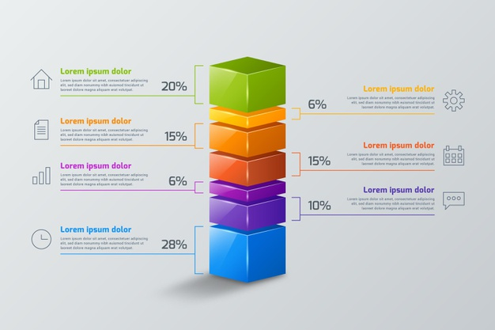
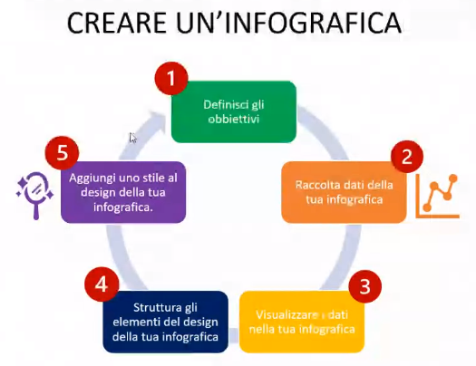

# Modalità di accesso all'informazione

**Docente**: Lorenzo Cristofori ([sito](https://www.lorenzocristofori.it/))  
**Appunti**: Alessandro Baccioli ([GitHub](https://alebaccioli.github.io/appunti/))  
**Licenza**: [CC BY-SA 4.0](https://creativecommons.org/licenses/by-sa/4.0/deed.it)

**Indice**:

- [1. Hardware](#1-hardware)
- [2. Memoria](#2-memoria)
  - [2.1. Cartelle](#21-cartelle)
  - [2.2. File](#22-file)
  - [2.3. Collegamenti](#23-collegamenti)
  - [2.4. Unità di misura](#24-unità-di-misura)
- [3. Digitalizzare le informazioni](#3-digitalizzare-le-informazioni)
- [4. Sintetizzazione delle informazioni](#4-sintetizzazione-delle-informazioni)
  - [4.1. Modifica della comunicazione](#41-modifica-della-comunicazione)
  - [4.2. Informazioni tramite immagini](#42-informazioni-tramite-immagini)
  - [4.3. Infografiche](#43-infografiche)
  - [4.4. PowerPoint](#44-powerpoint)
- [5. Internet](#5-internet)
  - [5.1. WWW](#51-www)
  - [5.2. HTML](#52-html)
    - [5.2.1. Struttura di una pagina](#521-struttura-di-una-pagina)
  - [5.3. Hosting e dominio](#53-hosting-e-dominio)
  - [5.4. CMS](#54-cms)
  - [5.5. Blog](#55-blog)
    - [5.5.1. Categorie e tag](#551-categorie-e-tag)
    - [5.5.2. Hashtag](#552-hashtag)
  - [5.6. Strumenti di web marketing](#56-strumenti-di-web-marketing)

## 1. Hardware

**Data lezione**: 07/04/2021

Per **hardware** si intende l'insieme delle componenti meccaniche che costituiscono un dispositivo come un computer. La definizione comprende anche dispositivi esterni, chiamati **periferiche**, che permettono di inviare e di ricevere informazioni da un computer.

Le periferiche possono essere suddivise in periferiche di **input** o di **output**:

- **input**: inseriscono informazioni all'interno di un computer, es. scanner, mouse, tastiera, webcam
- **output**: ricevono informazioni da un computer, es. stampante, casse, monitor
- **input/output**: appartengono a entrambe le categorie
  - il touchscreen di un cellulare fa sia da schermo che da input dei tocchi sullo schermo
  - un gamepad invia comandi al computer ma riceve anche un *feedback* della vibrazione

## 2. Memoria

Una **memoria** permette di archiviare le informazioni. Possiamo vederla come un grande contenitore, all'interno del quale posso mettere altri contenitori più piccoli. Questo permette di organizzare le informazioni in modo da recuperarle più velocemente.

### 2.1. Cartelle

Per esempio, possiamo creare un contenitore, cioè una **cartella**, per archiviare le nostre foto. Ma nel caso avessimo migliaia di foto sarebbe comunque difficile andare a recuperare foto relative a un certo periodo. Possiamo quindi creare ulteriori cartelle, per esempio una per ogni anno, in modo da organizzarle meglio.

Ogni file ha un indirizzo che permette di individuarlo all'interno della memoria. L'indirizzo è composto da un insieme di contenitori, partendo dal contenitore più grande fino a quello più specifico. Nei sistemi *Windows*, il contenitore più grande prende tipicamente il nome di `C:`. Il simbolo `\` serve per separare i nomi dei contenitori. Esempio:

```
C:\Foto\2020\spiaggia.jpg
```

Quindi ogni indirizzo contiene dei contenitori (cartelle) e dei contenuti (file).

### 2.2. File

I **file** possono essere documenti, foto, musica, film. Anche i programmi sono composti da file. Essi contengono informazioni scritte in un **codice binario** (cioè una sequenza formata da `0` e `1`) che viene letto dal dispositivo.

Un dispositivo è in grado di riconoscere un tipo di un file (es. un documento o un'immagine) grazie all'**estensione**. L'estensione segue il nome del file ed è separata da esso da un punto (es. `spiaggia.jpg`, `spiaggia` è il nome e `jpg` è l'estensione).

Esempi di estensioni:

- **testo**: docx, doc, txt, odt
- **immagini**: jpg, jpeg, png, tiff, gif, psd
- **audio**: mp3, wav, aac
- **video**: mp4, avi, mov, mpeg
- **fogli di calcolo**: xlsx, xls, ods
- **pagine Internet**: html, php
- **multiformato**: pdf

*Windows* normalmente non mostra l'estensione dei file per sicurezza, perché modificando impropriamente l'estensione di un file questo potrebbe poi non essere riconosciuto dal dispositivo.

### 2.3. Collegamenti

**Data**: 14/04/2021

Spesso abbiamo bisogno di un file o una cartella, memorizzati da qualche parte nella nostra memoria, in una posizione più facile da raggiungere, per esempio sul desktop.

Un **collegamento** è un puntatore a un file o a una cartella. Possiamo vederlo come un interruttore che ci permette di utilizzare una lampadina posta più distante. Le icone dei collegamenti si distinguono grazie alla presenza di una freccia.

Dentro al menù *Start* abbiamo una lista dei programmi che possiamo avviare, ma questi non sono memorizzati all'interno del menù *Start*, ma piuttosto da qualche parte nella memoria. Nel menù *Start* abbiamo quindi dei collegamenti che puntano ai file che avviano i programmi.

Anche il web è fatto di collegamenti: ciascuna pagina può avere al proprio interno dei collegamenti ad altri file.

### 2.4. Unità di misura

L'unità di misura di una memoria è il **bit** (b), un'informazione che può avere il valore di `0` o `1`.

Molto spesso si usa anche un'altra unità di misura, il **Byte** (B) che corrisponde a un gruppo di 8 bit. Il Byte viene storicamente usato per rappresentare un carattere di testo in un computer.

I multipli di un Byte sono:

- 1024 B = 1 KiloByte (KB)
- 1024 KB = 1 MegaByte (MB)
- 1024 MB = 1 GigaByte (GB)
- 1024 GB = 1 TeraByte (TB)

## 3. Digitalizzare le informazioni

**Digitalizzare** significa trasformare un'informazione in linguaggio informatico, nello specifico in codice binario. Per esempio, possiamo prendere un documento cartaceo e digitalizzarlo usando uno scanner, oppure creare direttamente un documento digitale.

Digitalizzare permette di avere certi vantaggi:

- avere tanti contenuti in un piccolo spazio organizzato, invece di copie cartacee che occupano spazio fisico e che possono rendere difficile recuperare con facilità le informazioni di cui abbiamo bisogno
- condividere i documenti con altre persone tramite Internet, con una copia fisica siamo molto più limitati
- le informazioni all'interno di un documento possono essere collegate a informazioni presenti in altri documenti, per esempio collegamenti tra pagine web o informazioni di clienti collegati a un prodotto a sua volta collegato a un fornitore, cosa impossibile da fare con documenti cartacei

Possono esserci anche degli svantaggi:

- un problema sulla sicurezza quando condividiamo informazioni, quindi servono sistemi che impediscono l'accesso a persone non autorizzate
- i dati possono essere persi a causa di fallimento delle memorie, servono quindi backup in base alla frequenza di produzione dei dati, su hard disk esterno o in cloud

È importante digitalizzare nel formato giusto. Normalmente uno scanner converte un'informazione in formato immagine (tipo una foto): questo impedisce di accedere al testo in una forma utilizzabile per altri scopi.

È quindi consigliabile utilizzare un **OCR** (Optical Character Recognition), un riconoscimento ottico dei caratteri capace di riconoscere il testo di un'immagine e di convertirlo in caratteri utilizzabili in un computer.

## 4. Sintetizzazione delle informazioni

**Data lezione**: 21/04/2021

L'informatizzazione ha obbligato a modificare il modo con cui vengono comunicate le informazioni. Internet ha apportato una maggiore comunicazione, spesso fino ad arrivare ad un eccesso. Viene sempre più richiesta oggigiorno una sintetizzazione delle informazioni anche facendo uso di immagini.

### 4.1. Modifica della comunicazione

Una volta si tendeva a comunicare senza delle regole ben precise, l'importante era che l'informazione arrivasse in qualche modo. Oggi è diverso: se inviassi un'email con i caratteri scritti tutti in maiuscolo (su Internet ha il significato di urlare) il messaggio risulterebbe fastidioso aldilà delle informazioni che contiene. È importante quindi anche il modo di comunicare.

Un tipo di scrittura a mano può comunicare qualcosa a chi legge, mentre un testo digitale di per sé è asettico. È importante quindi scegliere un carattere giusto rispetto al contesto: un invito ad una festa elegante richiederà un tipo di carattere differente rispetto a un invito ad una festa per bambini. Scegliere un tipo di carattere arzigogolato solo perché sembra bello a noi può invece inficiare la leggibilità di chi legge.

### 4.2. Informazioni tramite immagini

Le informazioni vengono sempre più spesso veicolate tramite un sistema digitale, ma la tendenza degli ultimi tempi è quella di spostarsi verso una sintetizzazione tramite immagini, un'**iconografia**.

Le icone di uno smartphone rappresentano le applicazioni che possiamo usare. Esse trasmettono un'informazione istantaneamente, per esempio il simbolo di una persona che corre già ci comunica la funzionalità dell'applicazione che ci aspettiamo di trovare.

A seconda del contesto possiamo usare differenti tipi di immagini. Una foto raffigurante una persona che corre sulla spiaggia ci porta una serie di informazioni che magari sono rivolte più a un pubblico maschile o femminile o atletico. Mentre l'immagine stilizzata di una persona che corre all'interno di un'icona ci porta direttamente l'informazione senza messaggi ulteriori.

Le icone si stanno sintetizzando ulteriormente rispetto al passato in modo che l'informazione arrivi in maniera ancor più immediata. Anche su sistemi diversi (es. *Apple*, *Android*) un utente è in grado di riconoscere certi simboli universali, come una cornetta per telefonare.

### 4.3. Infografiche

Quando viene fatta una presentazione al pubblico, spesso si usano delle slide per accompagnare quello che viene esposto in modo che l'informazione venga recepita meglio. Ma certe volte le slide vengono utilizzate in modo sbagliato, per esempio utilizzando slide piene di testo scritto. Non ha molto senso mettere grandi quantità di testo da leggere mentre l'interlocutore sta parlando, non aiuta molto la comunicazione.

Anche certi articoli pubblicati sul web con testi esageratamente lunghi difficilmente verranno letti. Non è un tipo di comunicazione basato su strumenti di vecchio stampo.

In questi casi le **infografiche** sono degli utili strumenti. Rappresentano le informazioni tramite grafici con testo molto ridotto, in modo che i concetti vengano sintetizzati e resi più leggibili.



[Freepik](https://www.freepik.com/): sito per risorse grafiche

Creare un'infografica del genere richiede generalmente un discreto impiego di programmi di grafica, anche se esistono alcuni strumenti che ci permettono di creare infografiche semplici. L'importante è riuscire a collegare piccole informazioni a elementi grafici in modo da far arrivare il concetto molto rapidamente.

*PowerPoint* è tra gli strumenti più tipicamente utilizzati per fare infografiche non troppo complesse, ma in generale si può usare anche *Word*.

Per creare un'infografica serve:

1. definire gli obiettivi dell'infografica, es. quante persone vaccinate in un territorio
1. raccolta dei dati per l'infografica, es. dati dei vaccinati
1. visualizzare i dati nell'infografica, cioè dare un'impostazione grafica e logica ai dati
1. strutturare gli elementi del design, collegando dati a descrizioni
1. dare uno stile al design dell'infografica, in modo che sia gradito a chi la vede

Questa serie di passaggi testuali può essere sintetizzata proprio da un'infografica:



### 4.4. PowerPoint

***PowerPoint*** è un software che utilizza delle **diapositive** (o **slide**) per raggruppare i contenuti. Qualsiasi concetto voglia inserire in *PowerPoint* devo organizzarlo in un collage di diapositive, in modo da potersi spostare da una all'altra a seconda dell'argomento trattato in aula.

Possiamo scegliere una dimensione delle diapositive adatte per la proiezione, ma esistono anche dimensioni più adatte per la stampa cartacea sebbene lo scopo della presentazione sia generalmente la proiezione su schermo.

Una **casella di testo** rappresenta un contenitore di testo che possiamo inserire nella diapositiva. Oltre a testo possiamo inserire immagini, forme, grafici. Possiamo mettere una serie di immagini una sopra l'altra e possiamo scegliere l'ordine di sovrapposizione. Le ***SmartArt*** ci permettono di creare velocemente piccole infografiche.

Trascinando un'immagine da un angolo possiamo allargare o ridurre l'immagine mantenendo il rapporto altezza/larghezza originale dell'immagine, mentre trascinandola di lato l'immagine non mantiene il rapporto e viene deformata.

Si possono applicare animazioni su certi elementi (es. un'immagine) e transizioni tra una slide e l'altra. Non sono obbligatorie, ma se fatte bene attirano l'attenzione su un elemento particolare della nostra slide aiutando la comunicazione.

## 5. Internet

Per **Internet** si intende un insieme di computer e dispositivi collegati tra loro. Nello specifico una parte della memoria interna di quel dispositivo è collegato a Internet. È il principio di condivisione.

I computer che offrono i servizi Internet come il web, chiamati **server**, sono continuamente collegati a Internet. La prima arcaica versione di Internet fu creata per scopi militari e si chiamava *ARPAnet*. Poi Internet venne diffusa tra le università, ma allora era possibile scambiarsi solo piccoli messaggi date le ridotte capacità dei calcolatori. 

### 5.1. WWW

Solo a partire dagli anni '90 ci fu una rivoluzione conosciuta come il **WWW** (World Wide Web). Un WWW (spesso abbreviato in **web**) è un'insieme di cartelle all'interno delle quali sono inserite altre cartelle. Ciascun **sito** è una cartella del web all'interno della quale troviamo le **pagine**. I siti Internet quindi funzionano come le cartelle all'interno di un computer.

Internet, oltre al WWW, permette di usufruire di altri servizi come la posta elettronica, l'instant messaging (le chat), le video conferenze.

Quando scrivo il nome di un sito, es. `www.lorenzocristofori.it`, un sistema automatico mi porta alla **pagina indice** del sito. Un sito è da considerare come un insieme di pagine, non esiste un sito senza pagine.

Le pagine sono collegate tra loro tramite un **link** (collegamento). I link possono essere **interni** (all'interno del mio sito) o **esterni** (portano a un sito diverso).

<!--
Data: 26/04/2021
Nome file: ok
Apostrofi: ok
-->

<!--
Data: 26/04/2021
Grammatica: ok
Codice: ok
Sezioni e TOC: ok
Pagina: ok
-->

<!--
Data: 29/04/2021
Grammatica: ok
Sezioni e TOC: ok
Info corso: ok
-->

### 5.2. HTML

Le pagine sono create tramite un'insieme di linguaggi, in particolar modo l'**HTML** (HyperText Markup Language). Si tratta di semplice testo abbinato a una serie di *marker* (chiamati **tag**) che definiscono come deve essere visualizzato quel testo. Non viene considerato come un vero linguaggio di programmazione ma piuttosto di marcazione, è un concetto leggermente diverso. 

I tag HTML iniziano con il simbolo di minore `<`, poi abbiamo il nome del tag e infine il simbolo di maggiore `>`, es `<html>`. Molti tag (ma non tutti) devono essere chiusi da qualche parte inserendo lo stesso tag ma con il simbolo `/` davanti al nome, es. `</html>`. All'interno di due tag aperto e chiuso mettiamo il contenuto che vogliamo.

Il **browser**, cioè il programma che ci consente di visualizzare le pagine come *Chrome*, riceve questo codice e lo interpreta.

Si può vedere il codice HTML di una pagina cliccando col tasto destro su una pagina e poi su *Visualizza sorgente pagina* o similare.

Quando si visita un sito web, la prima pagina che viene mostrata è chiamata **homepage** ed è salvata in un file con nome `index.html`. Il browser sa da solo che per accedere a quella pagina deve aprire il file con quel nome.

[*Notepad++*](https://notepad-plus-plus.org/) è un editor di testo che aiuta nella compilazione del codice HTML suggerendo i tag mentre li stiamo scrivendo.

[*Flaticon*](https://www.flaticon.com/): sito per icone

*Mirroid* è un'app che permette di portare lo schermo del cellulare sul PC.

#### 5.2.1. Struttura di una pagina

**Data lezione**: 28/04/2021

Il tag `<html>` è il più importante perché definisce l'area all'interno della quale abbiamo il codice della nostra pagina. I file che contengono le pagine devono avere un'estensione `.html`.

La struttura di una pagina HTML comprende una **testa** `<head>` che contiene codice che non vediamo nella pagina e un **corpo** `<body>` che contiene gli elementi che vediamo.

Anche se il nostro testo ha delle rientranze, queste vengono normalmente ignorate dall'HTML. È necessario avvisarlo che si vuole andare accapo per esempio inserendo un tag `<p>` che definisce un **paragrafo** di testo.

Il tag `<a>` permette di **collegare** una pagina all'altra. Il tag `` premette di inserire un'**immagine**.

I tag possono avere degli **attributi** che ne definiscono le proprietà. La sintassi è `<tag attributo="valore">Testo</tag>`.

Possiamo definire la nostra pagina `index.html`:

```html
<html>
  <head>

  </head>
  <body>

    <p align="center">
      <font size="10" color="blue">Ciao da Teseo</font>
    </p>
  
    <a href="pagina2.html">
      <font size="5">Vai a pagina 2</font>
    </a>
  
  </body>
</html>
```

Gli spazi prima dei tag non sono obbligatori e vengono ignorati dall'HTML. Migliorano la leggibilità del codice strutturandolo a livelli.

Abbiamo messo un collegamento a una pagina con il nome `pagina2.html`. Ora la definiamo:

```html
<html>
  <head>

  </head>
  <body>
  
    <p>
      <font size="9" color="red">Benvenuti Pagina 2</font>
    </p>

    

  </body>
</html>
```

Da notare che `` non richiede tag di chiusura.

Come si può vedere dal codice, le pagine *non* contengono le immagini, ma solo dei riferimenti ad esse. Un documento in *Word* invece integra l'immagine all'interno del documento stesso.

### 5.3. Hosting e dominio

Le nostre pagine si trovano attualmente nella nostra memoria. Per essere reperibili anche da altre persone dobbiamo metterle in uno spazio da qualche parte su Internet.

Un sito web ha bisogno di due cose:

- un **hosting**:
  - è lo spazio di un hard disk di un server web sempre disponibile, conterrà le nostre pagine
  - una delle ditte più famose in Italia che offre questo servizio è *Aruba*, ma ovviamente ne esistono molte altre
  - tipicamente si tratta di un servizio a pagamento, i costi variano a seconda del pacchetto di servizi
- un **dominio**:
  - è il nome del sito web su Internet, nessuno in tutto il mondo può avere lo stesso nome, non esistono siti con domini identici
  - `lorenzocristofori.it` è un dominio diverso da `lorenzocristofori.com`
  - `lorenzocristofori` è il **nome** del sito, `it` è il **suffisso**, nome e suffisso insieme formano il dominio
  - il suffisso `com` denota connotazione internazionale, `it` italiana

Molti servizi come *Aruba* offrono pacchetti hosting + dominio incluso.

I domini vengono gestiti da un'authority internazionale che ne registra la proprietà. La registrazione di un dominio ha una durata, se un domino scade qualcun altro potrebbe poi comprarlo e usarlo senza problemi.

Una volta qualcuno registrava a suo nome i domini associati al nome di personaggi famosi per poi rivenderli, ora questo comportamento è maggiormente regolamentato.

Non ci sono servizi gratuiti che rilasciano domini, ma registrandosi a servizi tipo *Blogspot* si può ottenere un sottodominio col nome scelto, es. `paperino.blogspot.com`.

**Annotazione mia**: *Blogspot* ora si chiama *Blogger*.

I suffissi si differenziano per:

- nazioni: it, eu, fr, uk
- tipologia tradizionale: com, net, org (senza scopo di lucro), gov (enti governativi)
- novità degli ultimi anni: blog, design, me e molti altri

Aziende come *Google* hanno tantissimi domini con stesso nome e suffissi diversi.

### 5.4. CMS

L'HTML è la base delle pagine, ma come visto in precedenza richiede che i contenuti vengano aggiornati a mano. I siti Internet si sono evoluti, alcuni hanno pagine che sono in grado di compilarsi in automatico tramite l'utilizzo di **database**.

A seconda di quello che cerchiamo, la pagina (che normalmente ha un'estensione `.php` o `.asp`) andrà a richiedere i relativi dati al database. Una volta ottenuti la pagina integrerà i dati e li mostrerà all'utente.

Per es. quando facciamo una ricerca su *Google*, la pagina di ricerca si compila in automatico in base a quello che abbiamo cercato. La pagina non è stata generata a mano con codice HTML, ma si è generata in automatico.

I **CMS** (Content Management System) permettono di fare questo, sono delle piattaforme già pronte che possiamo personalizzare per costruire il nostro sito. I contenuti che inseriamo in questa piattaforma vengono salvati in un database, e il CMS li userà per compilare le pagine al posto nostro.

*WordPress* è il più conosciuto. Moltissimi siti web sono costruiti con questo CMS, ma ne esistono altri come *Joomla*. *Blogspot* usa un suo CMS.

Quando inseriamo i contenuti in un CMS vediamo già l'aspetto della pagina finale, come succede in *Word*. Questo meccanismo viene chiamato *WYSIWYG* (What You See Is What You Get). Quando invece scriviamo una pagina in HTML non vediamo i risultati della pagina ma solo il codice.

### 5.5. Blog

*WordPress* nacque come piattaforma per i **blog**. I blog sono uno spazio solitamente personale dove vengono esposti propri pensieri o articoli su un argomento. I visitatori possono interagire commentando gli articoli.

Alcuni blog hanno avuto molto successo e hanno attirato interesse e pubblicità.

#### 5.5.1. Categorie e tag

Un argomento è tipicamente strutturato in articoli, chiamati **post**. Per gestire in modo organizzato i post di un blog sono nati i termini **categorie** e **tag** (etichetta).

Un blog può essere visto come un grande contenitore. Per organizzare meglio gli argomenti vengono utilizzate le categorie, es. hardware, software, cellulari per l'argomento tecnologia.

Certe volte però gli articoli trattano di concetti che possono stare in più categorie, cioè hanno connessioni trasversali. I tag vengono usati per organizzare i concetti trasversalmente, sono usati come argomento di ricerca.

Quando creiamo un post su *WordPress* possiamo definire la categoria e i tag. Anche *Facebook* e i social hanno i tag, possiamo per es. taggare una persona. Perfino *WhatsApp* permette di taggare i partecipanti di un gruppo con il simbolo `@`.

Proviamo a fare un esempio di categorie e tag.

Argomento: ricette di cucina.

Categorie:

- primi piatti
- secondi piatti
- dessert

Tag:

- ricetta in 5 minuti
- ricetta senza glutine
- ricetta ipocalorica

#### 5.5.2. Hashtag

L'**hashtag**, simbolo hash `#`, è stato utilizzato per la prima volta da *Twitter* e funziona in maniera un po' diversa dai tag. Si usa per categorizzare in modo trasversale tutti i post fatti da tutte le persone che hanno usato quell'hashtag. I tag devono essere ben specifici in modo da orientare l'utente, gli hashtag possono essere molto più generici.

Non siamo obbligati a mettere un hashtag su *Twitter* o *Instagram*, ma se lo facciamo il nostro post comparirà quando una persona cercherà quel tipo di hashtag. Gli hashtag si possono usare anche su *Facebook*, ma non sono molto utilizzati.

### 5.6. Strumenti di web marketing

Una **landing page** è una pagina con una struttura specifica che l'utente raggiunge tipicamente dopo aver cliccato su una pubblicità. La pagina di solito tratta di un singolo argomento o prodotto.

Le pagine solitamente sono isolate dal resto del sito e hanno lo scopo di attirare più utenti possibili.

Es. una landing page con 10 ricette di cucina, se poi l'utente si iscrive  alla newsletter vengono inviate periodicamente altre ricette.

Il **SEO** (Search Engine Optimization) è un insieme di ottimizzazioni per facilitare ai motori di ricerca come *Google* il compito di indicizzare e posizionare meglio la nostra pagina nella lista dei risultati.

Un sito che si trova nella prima pagina dei risultati di una ricerca è importantissimo a livello commerciale.

Chi studia SEO deve capire come fa *Google* (e ovviamente gli altri motori di ricerca) a decidere chi sta prima e chi dopo. Queste scelte vengono fatte da un algoritmo che scansiona i siti e mette i risultati in un database. L'algoritmo è segreto, quindi capire come funziona è difficile.

Il ripetersi di certe **parole chiave** (**keyword**), come "torta al limone", aiuta il motore di ricerca a collegare il sito alla parola chiave e indicizzarlo meglio per quella parola. È quindi consigliabile cercare di spingere su certe parole chiave quando inseriamo i nostri contenuti, ma senza esagerare.

Le parole chiave però non bastano. Le ricerche di oggi sono sempre più colloquiali. Si fa una ricerca vocale o con *Alexa*, ci si sposta sempre di più dalla singola parola all'argomento di cui si sta parlando. Il motore di ricerca collega le varie parole e ne determina l'argomento, chiamato **topic**.

Inoltre anche i risultati sono sempre più personalizzati, per es. se si cerca una pizzeria verranno mostrate in primo luogo le pizzerie nelle vicinanze.

<!--
Data: 02/05/2021
Grammatica: ok
Codice: ok
Sezioni e TOC: ok
Pagina: ok
-->
